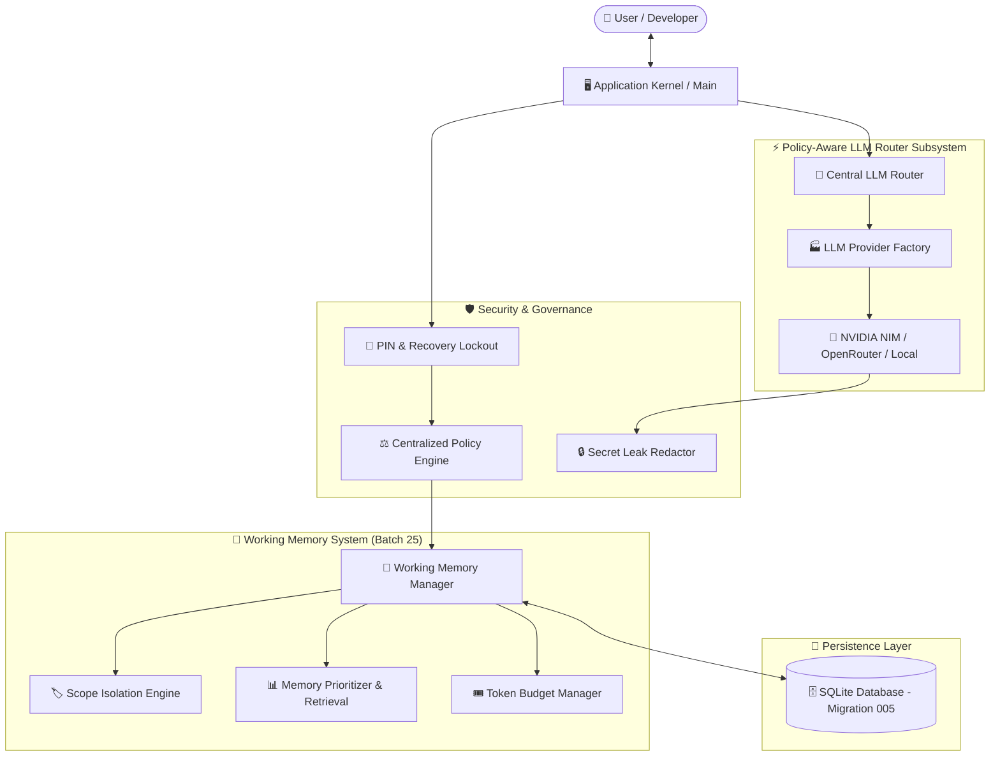

<div align="center">

# 🤖 J.A.R.V.I.S.
### *Just A Rather Very Intelligent System*
**A Production-Grade, Security-Hardened Autonomous AI Operating System for Windows**

[](https://www.python.org/downloads/)
[](https://www.microsoft.com/windows)
[](https://build.nvidia.com/)
[](https://www.sqlite.org/)
[](#security--governance)
[](LICENSE)
[](#-60-batch-implementation-roadmap)

<p align="center">
  <a href="#-key-features">Key Features</a> •
  <a href="#-system-architecture">Architecture</a> •
  <a href="#-quickstart">Quickstart</a> •
  <a href="#-60-batch-implementation-roadmap">Roadmap</a> •
  <a href="#-working-memory-subsystem">Working Memory</a> •
  <a href="#-quality-gate--testing">Quality Gate</a>
</p>

</div>

---

## 🌟 Overview

**JARVIS** is a production-oriented, autonomous personal AI operating system engineered from the ground up for Windows environments. Built with enterprise-grade software architecture, JARVIS delivers zero-trust security governance, a centralized policy approval engine, multi-provider LLM intelligence (NVIDIA NIM, OpenRouter, offline local GGUF, and intelligent router), persistent scope-aware working memory, transactional SQLite task persistence, and crash recovery resilience.

Unlike prototype AI scripts or basic chatbot wrappers, JARVIS is architected as a long-running, fault-tolerant operating system kernel capable of managing tools, background tasks, memory, system controls, and autonomous agent workflows safely.

---

## 🔥 Key Features

### 🛡️ 1. Zero-Trust Security & Authentication
* **PIN Authentication & Lockout**: Enforces secure PIN verification with automated 3-attempt brute-force lockout and security question recovery.
* **1-Hour Persistent Recovery Lockout**: Prevents unauthorized automated recovery attempts via encrypted state tracking.
* **Secret Leak Redactor**: Integrated real-time regex sanitization pipeline preventing API keys, tokens, or passwords from appearing in log streams, terminal output, or memory entries.

### ⚖️ 2. Centralized Authorization & Policy Engine
* **Rule-Based Access Control**: Decoupled policy engine evaluating risk levels, user permissions, path traversal safety, and explicit user approvals before executing any tool or OS operation.
* **State Machine Approvals**: Multi-state durable approval lifecycle (`PENDING`, `APPROVED`, `REJECTED`, `EXPIRED`, `CANCELLED`) backed by SQLite WAL persistence.

### 🧠 3. Persistent Scope-Aware Working Memory System (Batch 25)
* **Multi-Scope Context Isolation**: Enforces strict scope boundaries across `CONVERSATION`, `TASK`, `AGENT`, `SESSION`, `SYSTEM`, and `WORKING` scopes with owner-based isolation.
* **Selective Context Retrieval & Ranking**: Deterministically ranks candidate memories based on priority, scope relevance, recency decay, and keyword relevance while hard-filtering expired/unauthorized entries.
* **Context Window Token Budgeting**: Estimates token overhead and fits prioritized entries into context windows without silent memory content truncation.
* **Automated Expiration & Retention Cleanup**: Enforces timestamp-based memory expiration and automatic background retention cleanup.

### ⚡ 4. Multi-Provider LLM Intelligence & Intelligent Routing
* **Provider Abstraction Layer**: Generic `AbstractLLMProvider` contract standardizing chat completions, token usage tracking, latency benchmarking, and error handling.
* **Hosted & Offline Providers**: Integrated NVIDIA NIM, OpenRouter multi-model gateway, and local GGUF offline runtime.
* **Intelligent LLM Router**: Dynamic model routing engine featuring automated task classification, privacy policy enforcement, candidate ranking, and streaming safety.

### 💾 5. Transactional SQLite Persistence & Crash Recovery
* **Durable Task & Memory Repositories**: SQLite WAL-mode storage featuring optimistic concurrency locking and schema migrations 001-005.
* **Outbox Event Queue & Recovery Coordinator**: Process crash recovery engine that restores interrupted task states safely.

---

## 🏗️ System Architecture



---

## 🚀 Quickstart

### Prerequisites
* **OS**: Windows 10 / 11 (x64)
* **Python**: `Python >= 3.12`
* **Git**: Installed and configured

### 1. Clone Repository
```powershell
git clone https://github.com/Bhuvaneshkumar1/Jarvis.git
cd Jarvis
```

### 2. Create Virtual Environment
```powershell
python -m venv .venv
.\.venv\Scripts\Activate.ps1
```

### 3. Install Dependencies
```powershell
pip install -r requirements.txt
pip install -r requirements-dev.txt
pip install -e .
```

---

## 🧠 Working Memory Usage Example

```python
import asyncio
from jarvis.memory.working import WorkingMemoryManager, WorkingMemoryEntry, MemoryRetrievalFilter
from jarvis.core.enums import MemoryScope, SecurityLevel


def main():
    # Initialize Working Memory Manager
    manager = WorkingMemoryManager()

    # Create a Conversation-Scoped Working Memory Entry
    entry = WorkingMemoryEntry(
        scope=MemoryScope.CONVERSATION,
        owner_id="user_123",
        conversation_id="conv_001",
        content="User prefers Python code blocks and dark mode interface styling.",
        priority=8,
    )
    manager.create(entry)

    # Selectively Retrieve Working Memory within Context Token Budget
    filter_req = MemoryRetrievalFilter(
        scopes=[MemoryScope.CONVERSATION],
        owner_id="user_123",
        conversation_id="conv_001",
        token_budget=200,
        limit=5,
    )
    memories = manager.retrieve(filter_req)
    for mem in memories:
        print(f"[{mem.scope.value} - Priority {mem.priority}]: {mem.content}")


if __name__ == "__main__":
    main()
```

---

## 🧪 Quality Gate & Testing

JARVIS includes an automated local quality gate script (`scripts/quality_gate.py`) enforcing 100% compliance across linting, formatting, type checking, security scanning, and test suites:

```powershell
# Run Full Local Quality Gate Engine
python scripts/quality_gate.py
```

### Execute Test Suites
```powershell
# Run all unit and integration tests (390+ passing tests)
pytest

# Run working memory tests specifically
pytest tests/unit/memory/ tests/integration/memory/ -v
```

---

## 📊 60-Batch Implementation Roadmap

| Batch | Module Description | Status | Highlights |
| :---: | :--- | :---: | :--- |
| **01** | Repository Foundation & Architecture | `COMPLETED` | Architecture contracts, baseline directory structure |
| **02** | Architectural Contracts & Interfaces | `COMPLETED` | Core interfaces, exception hierarchy, status enums |
| **03** | CI Baseline, Quality Gates & Linter | `COMPLETED` | `quality_gate.py`, Ruff, Mypy, Bandit, Secret scanning |
| **04** | Runtime Lifecycle Kernel & Registry | `COMPLETED` | Component dependency graph, startup & shutdown hooks |
| **05** | Internal Event Bus & Messaging | `COMPLETED` | Priority async queue, retries, backoff, history tracking |
| **06** | Core Task Manager Base Engine | `COMPLETED` | Base task engine, dependency resolution |
| **07** | Core Orchestrator & Task Routing | `COMPLETED` | Routing engine, parallel task worker management |
| **08** | Configuration Management Engine | `COMPLETED` | Pydantic Settings, `.env` validation, sanitized summaries |
| **09** | Environment Hardening & Security | `COMPLETED` | `.env` security validation, git tracking protection |
| **10** | Encrypted Secrets Management | `COMPLETED` | AES-256 GCM encryption, secret rotation, leak scanning |
| **11** | Application Security Baseline | `COMPLETED` | Security policy enforcement, input validation |
| **12** | Core PIN Authentication Engine | `COMPLETED` | PBKDF2-HMAC-SHA256 PIN hashing, enrollment flow |
| **13** | PIN Attempt Tracking & Lockout | `COMPLETED` | 3-attempt lockout, persistent timer enforcement |
| **14** | Security Question Recovery | `COMPLETED` | Security question challenge, 1-hour recovery lockout |
| **15** | Centralized Policy & Approval Engine | `COMPLETED` | Rule-based authorization, risk downgrade blocking |
| **16** | Database Schema & SQLite Baseline | `COMPLETED` | SQLite WAL mode, Schema migrations 001-004 |
| **17** | Persistent Task Repository | `COMPLETED` | Transactional task persistence, optimistic locking |
| **18** | Approval Persistence & Lifecycle | `COMPLETED` | Approval repository, authorization engine integration |
| **19** | Persistent State Recovery | `COMPLETED` | Crash recovery coordinator, outbox queue replay |
| **20** | Unified LLM Provider Abstraction | `COMPLETED` | `AbstractLLMProvider`, LLM contracts, Factory |
| **21** | NVIDIA NIM Provider Integration | `COMPLETED` | `NVIDIAProvider`, Hosted OpenAPI, SSE streaming |
| **22** | OpenRouter Provider Integration | `COMPLETED` | `OpenRouterProvider`, Multi-model gateway, SSE streaming |
| **23** | Local LLM Provider Integration | `COMPLETED` | `LocalLLMProvider`, GGUF runtime, RAM limits, path security |
| **24** | Intelligent LLM Router & Fallback | `COMPLETED` | `LLMRouter`, task classification, privacy policy, candidate selector |
| **25** | Working Memory System | `COMPLETED` | `WorkingMemoryManager`, scope isolation, selective retrieval, token budgeting |
| **26-60** | Episodic, Semantic, Agents & OS | `PLANNED` | Long-term memory, vector index, and desktop OS agents |

---

## 📁 Repository Structure

```text
jarvis_v2/
├── config/                  # Configuration & Environment Hardening
├── docs/                    # Technical Subsystem Documentation
│   ├── llm/                 # LLM Provider Architecture & Guides
│   └── memory/              # Memory Architecture & Guides
│       └── working_memory.md
├── jarvis/
│   ├── core/                # Core Kernel Subsystems
│   ├── database/            # SQLite Database Infrastructure & Migrations
│   │   └── migrations/versions/005_working_memory_schema.py
│   ├── llm/                 # Unified LLM Provider Subsystem
│   └── memory/              # Scope-Aware Working Memory Subsystem (Batch 25)
│       ├── working_memory.py# Working Memory Top-Level Facade
│       └── working/         # Models, Repository, Prioritizer, Budget & Manager
├── scripts/
│   └── quality_gate.py      # Automated Local Quality Gate Engine
├── tests/                   # Comprehensive Pytest Test Suite
│   ├── unit/                # Unit Tests (390+ tests)
│   ├── integration/         # Integration & Live API Tests
│   └── security/            # Security & Secret Scanner Tests
├── .env.example             # Safe Environment Configuration Template
├── LICENSE                  # MIT License
├── main.py                  # CLI Application Entry Point
├── pyproject.toml           # Project Dependencies & Tool Specs
└── README.md                # Project Documentation & Architecture Blueprint
```

---

## 📜 License

Distributed under the **MIT License**. See [`LICENSE`](LICENSE) for details.

---

<div align="center">

**Built with ❤️ for Autonomous AI Systems**

⭐ **Star this repository on GitHub if you find JARVIS interesting!**

</div>
