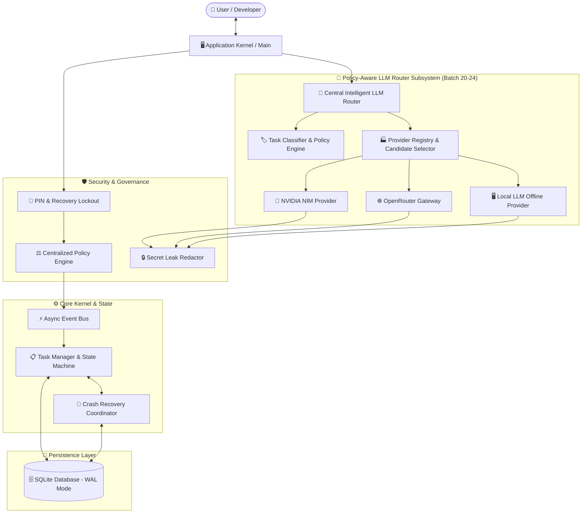

<div align="center">

# 🤖 J.A.R.V.I.S.
### *Just A Rather Very Intelligent System*
**A Production-Grade, Security-Hardened Autonomous AI Operating System for Windows**

[](https://www.python.org/downloads/)
[](https://www.microsoft.com/windows)
[](https://build.nvidia.com/)
[](https://www.sqlite.org/)
[](#security--governance)
[](LICENSE)
[](#-60-batch-implementation-roadmap)

<p align="center">
  <a href="#-key-features">Key Features</a> •
  <a href="#-system-architecture">Architecture</a> •
  <a href="#-quickstart">Quickstart</a> •
  <a href="#-60-batch-implementation-roadmap">Roadmap</a> •
  <a href="#-llm-provider-subsystem">LLM Subsystem</a> •
  <a href="#-quality-gate--testing">Quality Gate</a>
</p>

</div>

---

## 🌟 Overview

**JARVIS** is a production-oriented, autonomous personal AI operating system engineered from the ground up for Windows environments. Built with enterprise-grade software architecture, JARVIS delivers zero-trust security governance, a centralized policy approval engine, multi-provider LLM intelligence (including hosted NVIDIA NIM inference, OpenRouter multi-model gateway, offline local GGUF execution, and an intelligent policy-aware router), transactional SQLite task persistence, and crash recovery resilience.

Unlike prototype AI scripts or basic chatbot wrappers, JARVIS is architected as a long-running, fault-tolerant operating system kernel capable of managing tools, background tasks, memory, system controls, and autonomous agent workflows safely.

---

## 🔥 Key Features

### 🛡️ 1. Zero-Trust Security & Authentication
* **PIN Authentication & Lockout**: Enforces secure PIN verification with automated 3-attempt brute-force lockout and security question recovery.
* **1-Hour Persistent Recovery Lockout**: Prevents unauthorized automated recovery attempts via encrypted state tracking.
* **Secret Leak Redactor**: Integrated real-time regex sanitization pipeline preventing API keys, tokens, or passwords from appearing in log streams, terminal output, or diagnostic snapshots.

### ⚖️ 2. Centralized Authorization & Policy Engine
* **Rule-Based Access Control**: Decoupled policy engine evaluating risk levels, user permissions, path traversal safety, and explicit user approvals before executing any tool or OS operation.
* **State Machine Approvals**: Multi-state durable approval lifecycle (`PENDING`, `APPROVED`, `REJECTED`, `EXPIRED`, `CANCELLED`) backed by SQLite WAL persistence.

### ⚡ 3. Multi-Provider LLM Intelligence & Intelligent Routing
* **Provider Abstraction Layer**: Generic `AbstractLLMProvider` contract standardizing chat completions, token usage tracking, latency benchmarking, and error handling across cloud and local providers.
* **NVIDIA NIM Integration (`NVIDIAProvider`)**: Direct hosted API connectivity to NVIDIA's OpenAPI endpoints (`POST /v1/chat/completions`, `GET /v1/models`), featuring SSE streaming and tool calling.
* **OpenRouter Gateway Integration (`OpenRouterProvider`)**: Multi-model cloud gateway provider supporting models from OpenAI, Anthropic, Meta, and Google via unified OpenAPI endpoints.
* **Local LLM Offline Runtime (`LocalLLMProvider`)**: Resource-aware offline execution using GGUF quantization formats and `llama.cpp` Python bindings with strict memory and CPU utilization controls.
* **Intelligent LLM Router (`LLMRouter`)**: Policy-aware model routing engine featuring automated task classification, privacy data classification enforcement (`PUBLIC`, `INTERNAL`, `CONFIDENTIAL`, `RESTRICTED`), candidate score ranking, bounded fallback execution, and streaming safety.

### 💾 4. Transactional SQLite Persistence & Crash Recovery
* **Durable Task Repository**: SQLite WAL-mode task storage featuring state machine transitions (`PENDING`, `RUNNING`, `COMPLETED`, `FAILED`, `CANCELLED`) and optimistic concurrency locking.
* **Outbox Event Queue & Recovery Coordinator**: Process crash recovery engine that restores interrupted task states safely without duplicate execution or state corruption upon application restart.

### 🔄 5. Async Event Bus & Kernel Lifecycle Engine
* **Priority Event Bus**: Asynchronous event dispatch queue with priority ordering, subscriber error isolation, retry backoff, and event history tracking.
* **Application Kernel**: Standardized topological component dependency resolution, startup initialization, and graceful shutdown sequence.

---

## 🏗️ System Architecture



---

## 🚀 Quickstart

### Prerequisites
* **OS**: Windows 10 / 11 (x64)
* **Python**: `Python >= 3.12`
* **Git**: Installed and configured

### 1. Clone Repository
```powershell
git clone https://github.com/Bhuvaneshkumar1/Jarvis.git
cd Jarvis
```

### 2. Create Virtual Environment
```powershell
python -m venv .venv
.\.venv\Scripts\Activate.ps1
```

### 3. Install Dependencies
```powershell
pip install -r requirements.txt
pip install -r requirements-dev.txt
pip install -e .
```

### 4. Configure Environment Secrets
Copy `.env.example` to `.env` and fill in your credentials:
```powershell
Copy-Item .env.example .env
```
Edit `.env` to configure your settings and API keys:
```env
JARVIS_ENV=development
JARVIS_LOG_LEVEL=INFO
NVIDIA_API_KEY=nvapi-YOUR_ACTUAL_NVIDIA_API_KEY_HERE
OPENROUTER_API_KEY=sk-or-v1-YOUR_ACTUAL_OPENROUTER_API_KEY_HERE
LOCAL_LLM_MODEL_PATH=C:/jarvis/models/llama-3-8b-instruct.Q4_K_M.gguf
LLM_ROUTING_DEFAULT_PROFILE=balanced
```

---

## 🧠 Policy-Aware Intelligent LLM Router

JARVIS includes a policy-aware router (`LLMRouter`) that dynamically selects the best provider and model while strictly preserving user privacy and system availability.

```python
import asyncio
from jarvis.llm.contracts import LLMRequest, ChatMessage, TaskCategory, RoutingProfile
from jarvis.llm.router import LLMRouter
from jarvis.core.enums import MessageRole, SecurityLevel


async def main():
    # Initialize Central LLM Router (loads active providers dynamically)
    router = LLMRouter()
    await router.initialize()

    # Create a privacy-sensitive request
    request = LLMRequest(
        messages=[
            ChatMessage(role=MessageRole.SYSTEM, content="You are JARVIS."),
            ChatMessage(role=MessageRole.USER, content="Analyze local private financial data."),
        ],
        data_classification=SecurityLevel.CONFIDENTIAL,  # Automatically forces offline Local Provider
        task_category=TaskCategory.CODE,
        routing_profile=RoutingProfile.PRIVACY_FIRST,
    )

    # Route request safely
    response = await router.generate(request)
    print(f"Selected Provider: {response.provider_id}")
    print(f"Model Used: {response.model_id}")
    print(f"JARVIS: {response.content}")

    await router.close()


if __name__ == "__main__":
    asyncio.run(main())
```

---

## 🧪 Quality Gate & Testing

JARVIS includes an automated local quality gate script (`scripts/quality_gate.py`) enforcing 100% compliance across linting, formatting, type checking, security scanning, and test suites:

```powershell
# Run Full Local Quality Gate Engine
python scripts/quality_gate.py
```

### Execute Test Suites
```powershell
# Run all unit and integration tests (380+ passing tests)
pytest

# Run router unit tests specifically
pytest tests/unit/llm/routing/ tests/unit/llm/test_router.py -v

# Run integration tests
pytest tests/integration/llm/ -v
```

---

## 📊 60-Batch Implementation Roadmap

JARVIS is built through a rigorous 60-batch engineering blueprint.

| Batch | Module Description | Status | Highlights |
| :---: | :--- | :---: | :--- |
| **01** | Repository Foundation & Architecture | `COMPLETED` | Architecture contracts, baseline directory structure |
| **02** | Architectural Contracts & Interfaces | `COMPLETED` | Core interfaces, exception hierarchy, status enums |
| **03** | CI Baseline, Quality Gates & Linter | `COMPLETED` | `quality_gate.py`, Ruff, Mypy, Bandit, Secret scanning |
| **04** | Runtime Lifecycle Kernel & Registry | `COMPLETED` | Component dependency graph, startup & shutdown hooks |
| **05** | Internal Event Bus & Messaging | `COMPLETED` | Priority async queue, retries, backoff, history tracking |
| **06** | Core Task Manager Base Engine | `COMPLETED` | Base task engine, dependency resolution |
| **07** | Core Orchestrator & Task Routing | `COMPLETED` | Routing engine, parallel task worker management |
| **08** | Configuration Management Engine | `COMPLETED` | Pydantic Settings, `.env` validation, sanitized summaries |
| **09** | Environment Hardening & Security | `COMPLETED` | `.env` security validation, git tracking protection |
| **10** | Encrypted Secrets Management | `COMPLETED` | AES-256 GCM encryption, secret rotation, leak scanning |
| **11** | Application Security Baseline | `COMPLETED` | Security policy enforcement, input validation |
| **12** | Core PIN Authentication Engine | `COMPLETED` | PBKDF2-HMAC-SHA256 PIN hashing, enrollment flow |
| **13** | PIN Attempt Tracking & Lockout | `COMPLETED` | 3-attempt lockout, persistent timer enforcement |
| **14** | Security Question Recovery | `COMPLETED` | Security question challenge, 1-hour recovery lockout |
| **15** | Centralized Policy & Approval Engine | `COMPLETED` | Rule-based authorization, risk downgrade blocking |
| **16** | Database Schema & SQLite Baseline | `COMPLETED` | SQLite WAL mode, Schema migrations 001-004 |
| **17** | Persistent Task Repository | `COMPLETED` | Transactional task persistence, optimistic locking |
| **18** | Approval Persistence & Lifecycle | `COMPLETED` | Approval repository, authorization engine integration |
| **19** | Persistent State Recovery | `COMPLETED` | Crash recovery coordinator, outbox queue replay |
| **20** | Unified LLM Provider Abstraction | `COMPLETED` | `AbstractLLMProvider`, LLM contracts, Factory |
| **21** | NVIDIA NIM Provider Integration | `COMPLETED` | `NVIDIAProvider`, Hosted OpenAPI, SSE streaming |
| **22** | OpenRouter Provider Integration | `COMPLETED` | `OpenRouterProvider`, Multi-model gateway, SSE streaming |
| **23** | Local LLM Provider Integration | `COMPLETED` | `LocalLLMProvider`, GGUF runtime, RAM limits, path security |
| **24** | Intelligent LLM Router & Fallback | `COMPLETED` | `LLMRouter`, task classification, privacy policy, candidate selector, bounded fallback |
| **25-60** | Agents, Tools, Vision, Cyber & OS | `PLANNED` | Autonomous desktop agent OS capabilities |

---

## 📁 Repository Structure

```text
jarvis_v2/
├── config/                  # Configuration & Environment Hardening
│   ├── env_security.py      # .env file validation & git security scanner
│   └── settings.py          # Centralized Pydantic application settings
├── docs/                    # Technical Subsystem Documentation
│   └── llm/                 # LLM Provider Architecture & Guides
│       ├── local_provider.md
│       ├── nvidia_provider.md
│       ├── openrouter_provider.md
│       └── router.md
├── jarvis/
│   ├── core/                # Core Kernel Subsystems
│   │   ├── events/          # Asynchronous Event Bus Infrastructure
│   │   ├── logging.py       # Redacting Logger & Daily File Handler
│   │   ├── orchestrator.py  # Central Task Routing Orchestrator
│   │   ├── policy.py        # Centralized Policy & Authorization Engine
│   │   ├── recovery/        # State Crash Recovery & Outbox Coordinator
│   │   ├── runtime/         # Application Kernel & Component Registry
│   │   ├── secrets/         # Encrypted Master Key & Secret Store
│   │   └── security/        # PIN Auth, Lockout, and Recovery Engine
│   ├── db/                  # SQLite Database Infrastructure & Migrations
│   │   ├── connection.py    # Transactional Connection Pool & WAL Mode
│   │   └── migrations/      # Versioned Database Migration Scripts
│   └── llm/                 # Unified LLM Provider Subsystem
│       ├── base.py          # AbstractLLMProvider Base Contract
│       ├── contracts.py     # LLM Request, Response, Usage, & Stream Contracts
│       ├── exceptions.py    # LLM Exception Hierarchy & Secret Redactor
│       ├── factory.py       # LLMProviderFactory & Provider Registry
│       ├── local_runtime/   # Local GGUF Model Manager, RAM Limits & llama.cpp Runtime
│       ├── router.py        # Centralized Policy-Aware Intelligent LLM Router (Batch 24)
│       ├── routing/         # Classifier, Capability Matcher, Candidate Selector, Fallback & Explainer
│       └── providers/       # Concrete Provider Implementations
│           ├── local.py     # Local GGUF Offline Inference Provider (Batch 23)
│           ├── nvidia.py    # NVIDIA NIM Hosted Inference Provider (Batch 21)
│           └── openrouter.py# OpenRouter Multi-Model Hosted Provider (Batch 22)
├── scripts/
│   └── quality_gate.py      # Automated Local Quality Gate Engine
├── tests/                   # Comprehensive Pytest Test Suite
│   ├── unit/                # Unit Tests (380+ tests)
│   ├── integration/         # Integration & Live API Tests
│   └── security/            # Security & Secret Scanner Tests
├── .env.example             # Safe Environment Configuration Template
├── LICENSE                  # MIT License
├── main.py                  # CLI Application Entry Point
├── pyproject.toml           # Project Dependencies & Tool Specs
└── README.md                # Project Documentation & Architecture Blueprint
```

---

## 🛡️ Security & Privacy Guarantees

1. **Zero Hardcoded Secrets**: All credentials must be loaded from local `.env` or encrypted secret store.
2. **Automated Secret Scanning**: Local quality gate blocks any commit containing synthetic or real API keys.
3. **No Unsanitized Log Output**: `RedactFormatter` strips secret tokens from log files, exceptions, and console streams.
4. **Fail-Closed Authorization**: Default-deny security policy blocks unauthorized file, tool, or system operations.

---

## 📜 License

Distributed under the **MIT License**. See [`LICENSE`](LICENSE) for details.

---

<div align="center">

**Built with ❤️ for Autonomous AI Systems**

⭐ **Star this repository on GitHub if you find JARVIS interesting!**

</div>
