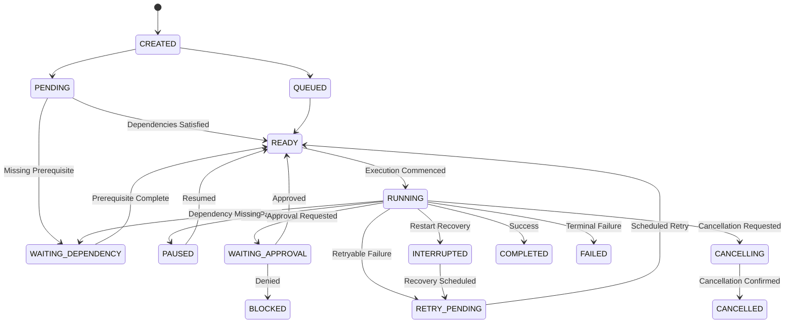
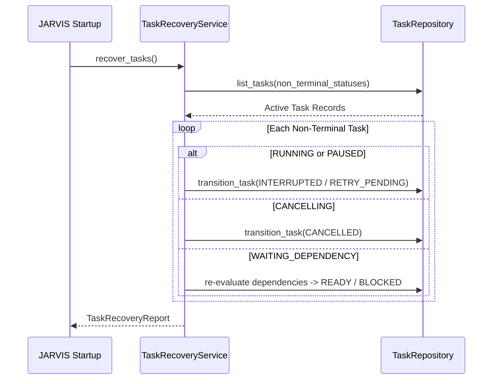

# JARVIS Persistent Task Repository & State Management (Batch 17)

## 1. Overview

The JARVIS Persistent Task Repository & State Management subsystem delivers production-grade, restart-safe, transaction-safe persistent task lifecycle management backed by SQLite 3 (`DatabaseManager`), centralized authorization (`PolicyEngine`), internal event streaming (`EventBus`), and strict state machine rules (`TaskStateMachine`).

JARVIS retains its task state across abrupt application crashes, process restarts, system reboots, and multi-component concurrent operations.

---

## 2. Architecture & Component Boundaries

```text
               +----------------------------------+
               |        Orchestrator / API        |
               +----------------------------------+
                                |
                                v
               +----------------------------------+
               |     Policy Engine (Batch 15)     |
               +----------------------------------+
                                |
                                v
               +----------------------------------+
               |           TaskManager            |
               | (Authoritative Coordinator)      |
               +----------------------------------+
                 /              |              \
                /               |               \
               v                v                v
      +-----------------+  +----------+   +-------------------+
      | TaskStateMachine|  | Recovery |   |  TaskEventPublisher|
      +-----------------+  +----------+   +-------------------+
               |                |                  |
               v                v                  v
    +--------------------------------------------------------+
    |                    TaskRepository                      |
    |        (SQLite Persistent Storage + Migration 002)     |
    +--------------------------------------------------------+
```

### Separation of Concerns
* **`TaskManager`**: Authoritative task lifecycle operations, authorization evaluation, event dispatching, and recovery coordination.
* **`TaskRepository`**: Thread-safe SQLite persistence, parameterized SQL query execution, transaction scope management, dependency graph management, history logging, and optimistic concurrency version increments.
* **`TaskStateMachine`**: Centralized transition validator enforcing permitted lifecycle state changes.
* **`TaskRecoveryService`**: Startup task recovery service inspecting non-terminal states and restoring consistent task state.
* **`TaskEventPublisher`**: Post-commit event delivery to the internal `EventBus`.

---

## 3. Database Schema & Migration `002_task_persistence_enhancements`

Migration `002_task_persistence_enhancements` extends the core `tasks` table and creates supporting indexes for high-throughput queries:

### Tables
1. **`tasks`**: Extended with `task_type`, `idempotency_key`, `deadline_at`, `due_at`, `assigned_agent_id`, `cancellation_requested`, `error_summary`.
2. **`task_dependencies`**: Managed relationships (`task_id`, `dependency_task_id`, `dependency_type`, `created_at`).
3. **`task_history`**: Persistent state audit trail (`history_id`, `task_id`, `from_status`, `to_status`, `timestamp`, `reason`, `metadata`).
4. **`task_attempts`**: Execution attempt history log (`attempt_id`, `task_id`, `attempt_number`, `started_at`, `completed_at`, `status`, `error_summary`).

---

## 4. State Machine Lifecycle & Transition Matrix

### State Diagram



### Permitted Transition Rules Matrix

| From Status | Permitted Target Statuses |
|---|---|
| `CREATED` | `QUEUED`, `PENDING`, `READY`, `RUNNING`, `CANCELLED` |
| `PENDING` | `QUEUED`, `READY`, `RUNNING`, `WAITING_DEPENDENCY`, `CANCELLED` |
| `QUEUED` | `READY`, `RUNNING`, `WAITING_DEPENDENCY`, `WAITING_APPROVAL`, `CANCELLED` |
| `READY` | `QUEUED`, `PENDING`, `RUNNING`, `PAUSED`, `WAITING_DEPENDENCY`, `CANCELLING`, `CANCELLED` |
| `RUNNING` | `COMPLETED`, `FAILED`, `PAUSED`, `WAITING_APPROVAL`, `WAITING_DEPENDENCY`, `RETRY_PENDING`, `CANCELLING`, `CANCELLED`, `INTERRUPTED` |
| `PAUSED` | `READY`, `RUNNING`, `CANCELLING`, `CANCELLED` |
| `WAITING_APPROVAL` | `READY`, `BLOCKED`, `CANCELLING`, `CANCELLED` |
| `WAITING_DEPENDENCY` | `READY`, `BLOCKED`, `CANCELLING`, `CANCELLED` |
| `RETRY_PENDING` | `READY`, `RUNNING`, `FAILED`, `CANCELLED` |
| `INTERRUPTED` | `RETRY_PENDING`, `READY`, `FAILED`, `CANCELLED` |
| `CANCELLING` | `CANCELLED`, `FAILED` |
| `FAILED` | `RETRY_PENDING` |
| `BLOCKED` | `READY` |
| `COMPLETED` | *(Terminal - None)* |
| `CANCELLED` | *(Terminal - None)* |

---

## 5. Key System Guarantees

### Idempotency
Task creation accepts an `idempotency_key`. Submitting identical payloads with the same key returns the existing task record. Submitting conflicting payloads with the same key raises `TaskDuplicateIdempotencyError`. Unique constraints at the database level enforce idempotency across concurrent threads.

### Optimistic Concurrency Control
Every state mutation increments the task `version`. Updates verify `expected_version == current_version`. Concurrent stale updates trigger `TaskVersionConflictError`.

### Dependency Cycle Prevention
Dependencies are checked using depth-first graph traversal on the persisted `task_dependencies` graph. Self-dependencies and circular dependencies raise `TaskDependencyError`.

### Restart Recovery Flow



---

## 6. Execution Commands

### Run Migrations
```bash
.venv\Scripts\python.exe -m jarvis.database.migrations.cli migrate
```

### Run Task Persistence Unit & Integration Tests
```bash
.venv\Scripts\python.exe -m pytest tests/unit/test_task_persistence.py tests/unit/test_task_concurrency_security.py tests/unit/test_task_state_machine.py tests/unit/test_task_manager.py -v
```

### Run Quality Gate Verification
```bash
.venv\Scripts\python.exe scripts/quality_gate.py
```
